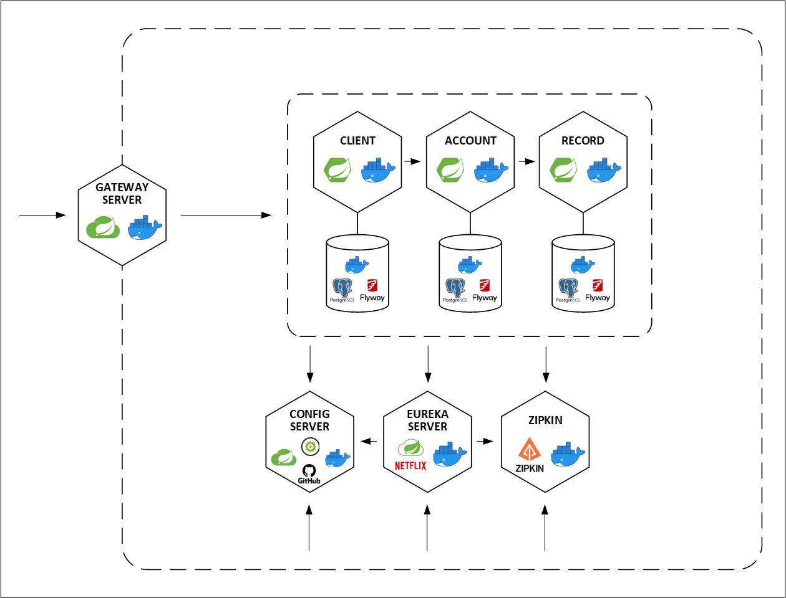

# Spring Banking System Services
## About the project
The application allows you to become a client of a bank, to create and to manage your accounts
ensuring that all operations will be recorded.

## Architecture

Microservices:
- GATEWAY SERVER - a gatekeeper for all inbound traffic to microservice calls within the application;
- CONFIG SERVER - a configuration manager with [a repository on GitHub](https://github.com/vl-blinov/spring-banking-system-services-config);
- EUREKA SERVER - a service registry;
- ZIPKIN - a distributed tracing platform that allows to trace transactions across multiple service invocations;
- CLIENT - a client registration service;
- ACCOUNT - a service that can open and close accounts for clients;
- RECORD - a service that makes a record on account opening/closing.
